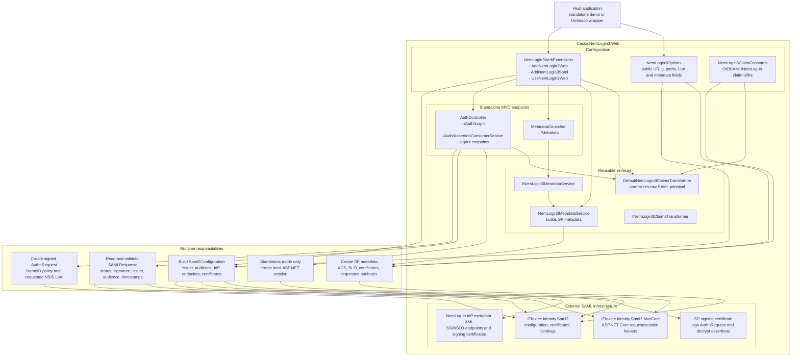

# Casko.NemLogin3.Web Code Structure

```mermaid
flowchart TB
    Host["Host application<br/>standalone demo or Umbraco wrapper"]

    subgraph Package["Casko.NemLogin3.Web"]
        subgraph Configuration["Configuration"]
            Extensions["NemLogin3WebExtensions<br/>- AddNemLogin3Web<br/>- AddNemLogin3Saml<br/>- UseNemLogin3Web"]
            Options["NemLogin3Options<br/>public URLs, paths, LoA and metadata fields"]
            ClaimConstants["NemLogin3ClaimConstants<br/>OIOSAML/NemLog-in claim URIs"]
        end

        subgraph Controllers["Standalone MVC endpoints"]
            AuthController["AuthController<br/>- /Auth/Login<br/>- /Auth/AssertionConsumerService<br/>- logout endpoints"]
            MetadataController["MetadataController<br/>- /Metadata"]
        end

        subgraph Services["Reusable services"]
            MetadataInterface["INemLogin3MetadataService"]
            MetadataService["NemLogin3MetadataService<br/>builds SP metadata"]
            ClaimsInterface["INemLogin3ClaimsTransformer"]
            ClaimsTransformer["DefaultNemLogin3ClaimsTransformer<br/>normalizes raw SAML principal"]
        end

        subgraph ExternalLibs["External SAML infrastructure"]
            ItfoxtecCore["ITfoxtec.Identity.Saml2<br/>configuration, certificates, bindings"]
            ItfoxtecMvc["ITfoxtec.Identity.Saml2.MvcCore<br/>ASP.NET Core request/session helpers"]
            IdpMetadata["NemLog-in IdP metadata XML<br/>SSO/SLO endpoints and signing certificates"]
            SigningCert["SP signing certificate<br/>sign AuthnRequest and decrypt assertions"]
        end
    end

    subgraph RuntimeResponsibilities["Runtime responsibilities"]
        SamlConfig["Build Saml2Configuration<br/>issuer, audience, IdP endpoints, certificates"]
        AuthnRequest["Create signed AuthnRequest<br/>NameID policy and requested NSIS LoA"]
        ResponseValidation["Read and validate SAMLResponse<br/>status, signature, issuer, audience, timestamps"]
        SessionCreation["Standalone mode only<br/>create local ASP.NET session"]
        MetadataDocument["Create SP metadata<br/>ACS, SLO, certificates, requested attributes"]
    end

    Host --> Extensions
    Host --> Options

    Extensions --> SamlConfig
    Extensions --> AuthController
    Extensions --> MetadataController
    Extensions --> MetadataService
    Extensions --> ClaimsTransformer

    Options --> SamlConfig
    Options --> MetadataDocument
    ClaimConstants --> MetadataDocument
    ClaimConstants --> ClaimsTransformer

    AuthController --> AuthnRequest
    AuthController --> ResponseValidation
    AuthController --> SessionCreation
    AuthController --> ClaimsTransformer

    MetadataController --> MetadataInterface
    MetadataInterface --> MetadataService
    MetadataService --> MetadataDocument

    SamlConfig --> IdpMetadata
    SamlConfig --> SigningCert
    SamlConfig --> ItfoxtecCore

    AuthnRequest --> ItfoxtecCore
    ResponseValidation --> ItfoxtecCore
    ResponseValidation --> ItfoxtecMvc
    SessionCreation --> ItfoxtecMvc
    MetadataDocument --> ItfoxtecCore
```

