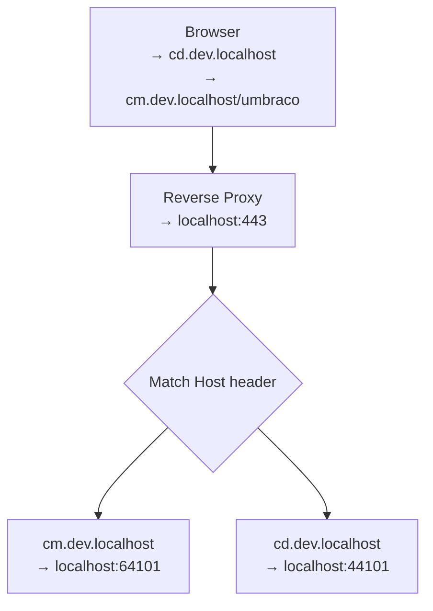

# Casko.NemLogin3ForUmbraco

This solution is a local Umbraco 17 / .NET 10 setup for running a single or multiple Umbraco. Supports `SchedulingPublisher` → `Subsciber` and `Single`. Will run `Single` out of the box.



## Projects

| Project | Purpose |
| ------- | ------- |
| `src/Casko.NemLogin3ForUmbraco` | Umbraco member and backoffice external login provider for NemLog-in 3. |
| `src/Casko.NemLogin3ForUmbraco.Web` | Shared helpers for server roles, environment-specific configuration, forwarded headers, and distributed cache setup. |
| `src/Casko.NemLogin3ForUmbraco.Web.UI` | Runnable Umbraco site used to validate the package locally. |
| `src/Casko.NemLogin3ForUmbraco.Yarp` | Local YARP reverse proxy for friendly hostnames and split-role development. |

The solution file is:

```text
src/Casko.NemLogin3ForUmbraco.slnx
```

## Prerequisites

- .NET 10 SDK
- A trusted ASP.NET Core HTTPS development certificate
- SQL Server available on `localhost,1434` for the split-role profiles

Trust the development certificate once per machine:

```powershell
dotnet dev-certs https --trust
```

## Build

From the repository root:

```powershell
dotnet build src/Casko.NemLogin3ForUmbraco.slnx
```

## Running locally

`Casko.NemLogin3ForUmbraco.Web.UI` has three launch profiles:

| Launch profile | URL | Role |
| -------------- | --- | ---- |
| `Umbraco.Web.UI.Single` | `https://localhost:24101/umbraco/` | Single-server local Umbraco instance |
| `Umbraco.Web.UI.SchedulingPublisher` | `https://cm.dev.localhost/umbraco/` | Backoffice / scheduling publisher |
| `Umbraco.Web.UI.Subscriber` | `https://cd.dev.localhost/` | Content delivery subscriber |

Run the single-server profile when you only need one local Umbraco instance:

```powershell
dotnet run --project src/Casko.NemLogin3ForUmbraco.Web.UI --launch-profile Umbraco.Web.UI.Single
```

Run the split-role setup when you want to test backoffice and delivery behavior separately:

```powershell
dotnet run --project src/Casko.NemLogin3ForUmbraco.Web.UI --launch-profile Umbraco.Web.UI.SchedulingPublisher
dotnet run --project src/Casko.NemLogin3ForUmbraco.Web.UI --launch-profile Umbraco.Web.UI.Subscriber
dotnet run --project src/Casko.NemLogin3ForUmbraco.Yarp --launch-profile LocalReverseProxy
```

Then browse to:

```text
https://cm.dev.localhost/umbraco/
https://cd.dev.localhost/
```

## Local reverse proxy

The YARP project listens on `https://localhost:443` and routes requests by host:

| Public URL | Destination |
| ---------- | ----------- |
| `https://cm.dev.localhost` | `https://localhost:64101/` |
| `https://cd.dev.localhost` | `https://localhost:44101/` |

See `src/Casko.NemLogin3ForUmbraco.Yarp/README.md` for details.

## Configuration model

The Web UI project uses `UMBRACO_SERVER_ROLE` to load role-specific configuration:

```text
appsettings.{UMBRACO_SERVER_ROLE}.json
appsettings.Development.{UMBRACO_SERVER_ROLE}.json
```

When `FORWARD_HEADERS_ENABLED=true`, it also loads:

```text
appsettings.Hosts.json
```

That file contains the public proxied Umbraco URLs used by the split-role setup:

```text
https://cm.dev.localhost
https://cd.dev.localhost/
```

Forwarded headers must be enabled for proxied profiles so Umbraco authentication and redirects use the public hostnames instead of internal Kestrel ports.

## Backoffice login

The development unattended install user is configured in `src/Casko.NemLogin3ForUmbraco.Web.UI/appsettings.Development.json`:

```text
admin@example.com
1234567890
```

Use the backoffice URL for split-role development:

```text
https://cm.dev.localhost/umbraco/
```

## Notes

- The Umbraco package references the reusable `Casko.Authentication.NemLogin3.Web` SAML package.
- Central package versions are managed in `src/Directory.Packages.props`.
- The YARP project is a local development tool, not the package itself.
