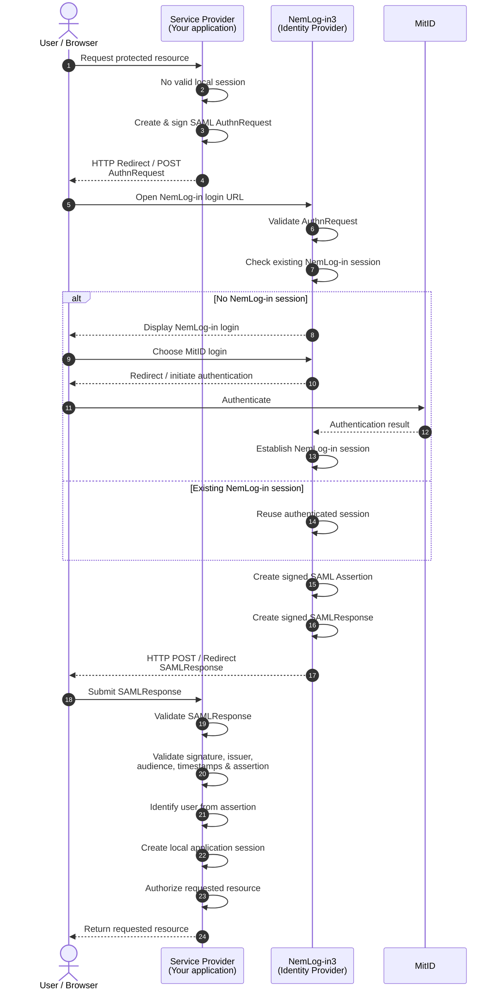

# USER → SP → IDP → LOGIN

```mermaid
sequenceDiagram
    autonumber

    actor User as User / Browser
    participant SP as Service Provider<br/>(Your application)
    participant NLI as NemLog-in3<br/>(Identity Provider)
    participant MitID as MitID

    User->>SP: Request protected resource
    SP->>SP: No valid local session
    SP->>SP: Create & sign SAML AuthnRequest

    SP-->>User: HTTP Redirect / POST<br/>AuthnRequest
    User->>NLI: Open NemLog-in login URL

    NLI->>NLI: Validate AuthnRequest
    NLI->>NLI: Check existing NemLog-in session

    alt No NemLog-in session
        NLI-->>User: Display NemLog-in login
        User->>NLI: Choose MitID login
        NLI-->>User: Redirect / initiate authentication
        User->>MitID: Authenticate
        MitID-->>NLI: Authentication result
        NLI->>NLI: Establish NemLog-in session
    else Existing NemLog-in session
        NLI->>NLI: Reuse authenticated session
    end

    NLI->>NLI: Create signed SAML Assertion
    NLI->>NLI: Create signed SAMLResponse

    NLI-->>User: HTTP POST / Redirect<br/>SAMLResponse
    User->>SP: Submit SAMLResponse

    SP->>SP: Validate SAMLResponse
    SP->>SP: Validate signature, issuer,<br/>audience, timestamps & assertion
    SP->>SP: Identify user from assertion
    SP->>SP: Create local application session
    SP->>SP: Authorize requested resource

    SP-->>User: Return requested resource

```