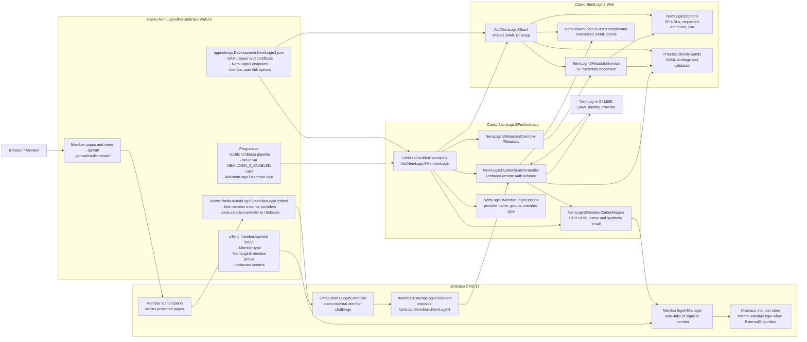

# Casko.NemLogin3ForUmbraco.Web.UI NemLogin3 Dependencies

```mermaid
flowchart LR
    Browser["Browser / Member"]
    NemLogin["NemLog-in 3 / MitID<br/>SAML Identity Provider"]

    subgraph WebUI["Casko.NemLogin3ForUmbraco.Web.UI"]
        Program["Program.cs<br/>- builds Umbraco pipeline<br/>- opt-in via NEMLOGIN_3_ENABLED<br/>- calls AddNemLogin3MemberLogin"]
        DemoConfig["appsettings.Development.NemLogin3.json<br/>- SAML issuer and certificate<br/>- NemLogin3 endpoints<br/>- member auto-link options"]
        MemberPages["Member pages and views<br/>- /privat/<br/>- /privat/medlemsside/"]
        LoginPartial["Views/Partials/NemLogin3MemberLogin.cshtml<br/>- lists member external providers<br/>- posts selected provider to Umbraco"]
        USync["uSync member/content setup<br/>- Member type<br/>- NemLogin3 member group<br/>- protected content"]
    end

    subgraph Umbraco["Umbraco CMS 17"]
        MemberProtection["Member authorization<br/>denies protected pages"]
        ExternalLoginController["UmbExternalLoginController<br/>starts external member challenge"]
        MemberExternalProviders["IMemberExternalLoginProviders<br/>exposes UmbracoMembers.NemLogin3"]
        MemberAutoLink["MemberSignInManager<br/>auto-links or signs in member"]
        MemberStore["Umbraco member store<br/>normal Member type when ExternalOnly=false"]
    end

    subgraph UmbracoNemLogin3["Casko.NemLogin3ForUmbraco"]
        BuilderExtension["UmbracoBuilderExtensions<br/>AddNemLogin3MemberLogin"]
        RemoteScheme["NemLogin3AuthenticationHandler<br/>Umbraco remote auth scheme"]
        MemberMapper["NemLogin3MemberClaimsMapper<br/>CPR UUID, name and synthetic email"]
        MetadataEndpoint["NemLogin3MetadataController<br/>/Metadata"]
        MemberOptions["NemLogin3MemberLoginOptions<br/>provider name, groups, member type"]
    end

    subgraph SharedSaml["Casko.NemLogin3.Web"]
        SamlRegistration["AddNemLogin3Saml<br/>shared SAML DI setup"]
        SamlOptions["NemLogin3Options<br/>SP URLs, requested attributes, LoA"]
        MetadataService["NemLogin3MetadataService<br/>SP metadata document"]
        ClaimsTransformer["DefaultNemLogin3ClaimsTransformer<br/>normalizes SAML claims"]
        Itfoxtec["ITfoxtec.Identity.Saml2<br/>SAML bindings and validation"]
    end

    Browser --> MemberPages
    MemberPages --> MemberProtection
    MemberProtection --> LoginPartial
    LoginPartial --> ExternalLoginController
    ExternalLoginController --> MemberExternalProviders
    MemberExternalProviders --> RemoteScheme

    Program --> BuilderExtension
    DemoConfig --> BuilderExtension
    DemoConfig --> SamlRegistration
    USync --> MemberAutoLink

    BuilderExtension --> MemberOptions
    BuilderExtension --> RemoteScheme
    BuilderExtension --> MemberMapper
    BuilderExtension --> MetadataEndpoint
    BuilderExtension --> SamlRegistration

    RemoteScheme --> Itfoxtec
    RemoteScheme --> ClaimsTransformer
    RemoteScheme --> MemberMapper
    RemoteScheme --> NemLogin
    NemLogin --> RemoteScheme

    MetadataEndpoint --> MetadataService
    MetadataService --> SamlOptions
    MetadataService --> Itfoxtec
    SamlRegistration --> SamlOptions
    SamlRegistration --> ClaimsTransformer
    SamlRegistration --> MetadataService
    SamlRegistration --> Itfoxtec

    MemberMapper --> MemberAutoLink
    MemberAutoLink --> MemberStore
```
